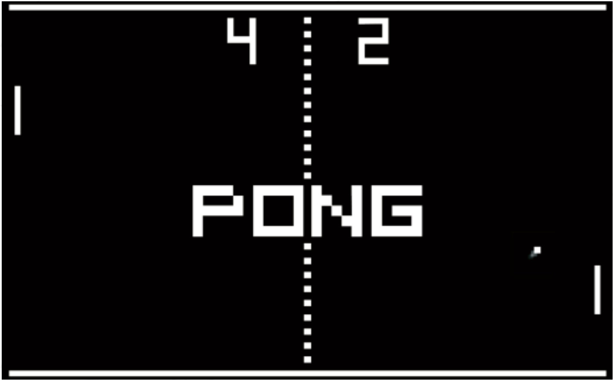

# ft_transcendence <Version: 12.1>
## : Soon, you will realize that you already know things that you thought you didn’t

## [Project 진행 상황에 따른 이슈 관리 \_\_Click Here\_\_ ](https://github.com/orgs/5GoInMul-Transcendence/projects/2/views/1)

### Summary:
- No more C! No more C++!
- 더 이상 C는 없습니다! C++ 은 이제 그만!

- This project is about doing something you’ve never done before.
- 이 프로젝트는 여러분이 한 번도 해보지 않은 일을 해보는 것입니다.

- Remind yourself the beginning of your journey in computer science.
- 컴퓨터 공학 여정의 시작을 떠올려보세요.

- Look at you now. Time to shine!
- 지금 여러분을 보세요. 빛을 발할 시간입니다!

# Contents
1. Preamble
2. Mandatory part
    2.1 Overview
    2.2 Security concerns
    2.3 User Account
    2.4 Chat
    2.5 Game
3. Submission and peer-evaluation

# Chapter 1
# Preamble

# Chapter 2
# Mandatory part
- This project is about creating a website for the mighty Pong contest!
- 이 프로젝트는 강력한 퐁 대회를 위한 웹사이트를 만드는 것입니다!

## II.1 Overview
- Thanks to your website, users will play Pong with others. You will provide a nice user interface, a chat, and real-time multiplayer online games!
- 여러분의 웹사이트를 통해, 유저들은 다른 사람들과 Pong 게임을 플레이 할 겁니다. 멋진 사용자 인터페이스, 채팅, 실시간 멀티플레이어 온라인 게임을 제공할 겁니다.

- Your work has to comply with the following rules:
- 작업은 다음 따라오는 규칙들을 준수해야 합니다.

    - Your website backend must be written in NestJS.
    - 웹사이트 백엔드는 NestJS 로 작성되어야 합니다.

    - The frontend must be written with a TypeScript framework of your choice.
    - 프론트 엔드는 당신이 선택한 Typescript framework로 작성되어야 합니다.

    - You are free to use any library you want to in this context. However, you must use the latest stable version of every library or framework used in your project.
    - 이 맥락에서 당신이 원하는 어떤 라이브러리를 사용해도 됩니다. 그러나, 프로젝트에서 사용되는 모든 라이브러리와 프레임워크의 최신 안정 버전을 사용해야 합니다.

    - You must use a PostgreSQL database. That’s it, no other database.
    - 당신은 반드시 PostgreSQL 데이터베이스를 사용해야 합니다. 
    - Your website must be a single-page application. The user should be able to use the Back and Forward buttons of the browser.
    - Your website must be compatible with the latest stable up-to-date version of
    Google Chrome and one additional web browser of your choice.
    - The user should encounter no unhandled errors and no warnings when browsing the website.
    - Everything has to be launch by a single call to: docker-compose up --build